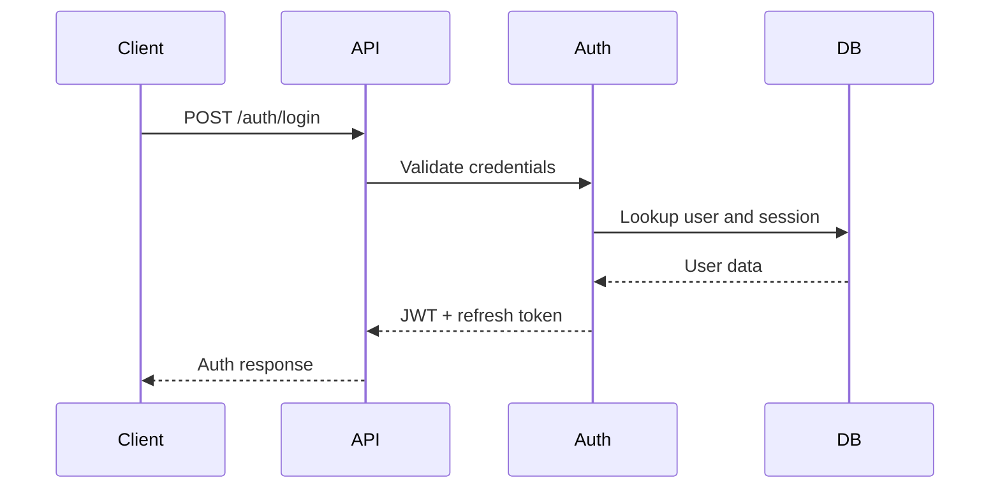

# API Design

## Overview
The API is a RESTful NestJS service exposing versioned endpoints for authentication, profiles, companies, reviews, applications, search, notifications, and admin operations.

## Versioning
- Base path: /api/v1
- Use explicit versioning in route definitions and contract files
- Deprecate gradually with compatibility windows

## Core Endpoints
### Authentication
- POST /api/v1/auth/register
- POST /api/v1/auth/login
- POST /api/v1/auth/logout
- POST /api/v1/auth/refresh
- GET /api/v1/auth/me

### Users
- GET /api/v1/users/me
- PATCH /api/v1/users/me
- GET /api/v1/users/:id
- GET /api/v1/users/:id/companies

### Companies
- GET /api/v1/companies
- POST /api/v1/companies
- GET /api/v1/companies/:id
- PATCH /api/v1/companies/:id
- GET /api/v1/companies/:id/reviews
- POST /api/v1/companies/:id/apply

### Reviews
- POST /api/v1/reviews
- GET /api/v1/reviews/:id
- PATCH /api/v1/reviews/:id
- DELETE /api/v1/reviews/:id
- POST /api/v1/reviews/:id/vote

### Applications
- GET /api/v1/applications
- GET /api/v1/applications/:id
- POST /api/v1/applications/:id/decide

### Notifications
- GET /api/v1/notifications
- PATCH /api/v1/notifications/:id/read

### Admin
- GET /api/v1/admin/moderation
- PATCH /api/v1/admin/moderation/:id
- GET /api/v1/admin/analytics

## OpenAPI Strategy
- Generate OpenAPI from decorators and shared DTOs
- Publish Swagger UI in non-production environments
- Use contract tests to protect public API compatibility

## Sequence Example

