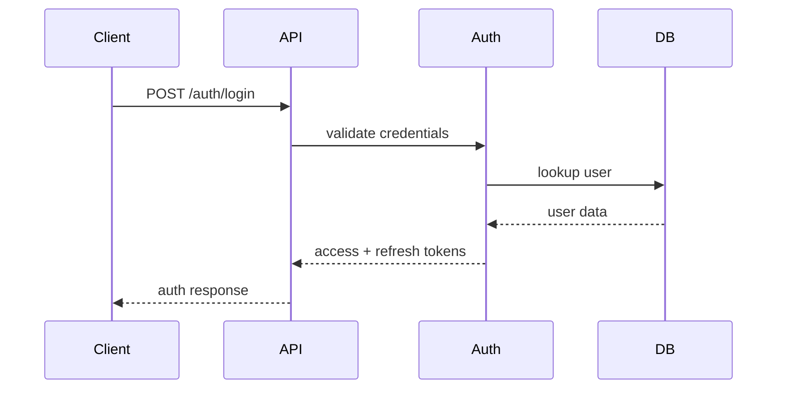

# API Design

## Overview

The API is a NestJS REST service. Routes are **unprefixed** — there is no `/api/v1` versioning, and no OpenAPI/Swagger generation is wired up. The list below was generated directly from the controller decorators in `apps/api/src`, so it reflects what's actually routable, not a plan.

Reminder: LinkedOut reverses traditional hiring — companies discover professionals and send opportunities; professionals do not submit applications ([decisions.md](decisions.md) D-001).

## Auth — `/auth`

- `POST /auth/register`
- `POST /auth/login`
- `POST /auth/refresh`
- `POST /auth/logout`
- `POST /auth/verify-email`
- `POST /auth/resend-verification`

## Users (admin) — `/users`

- `GET /users/lookup`
- `PATCH /users/:id/role`

## Professionals — `/professionals`

- `GET /professionals` — search/discovery; `q` matches fullName or headline, plus `headline`/`location`/`skill`/`activelyLooking` filters
- `GET /professionals/me`
- `PATCH /professionals/me`
- `GET /professionals/:id`
- `GET /professionals/:id/skills`
- `GET /professionals/:id/portfolio-links`
- `GET /professionals/:id/employment-expectation`
- `GET/PUT /professionals/me/skills`
- `GET/POST /professionals/me/portfolio-links`, `PATCH/DELETE /professionals/me/portfolio-links/:linkId`
- `GET/PUT /professionals/me/employment-expectation`
- `GET/POST /professionals/me/employment-history`, `PATCH/DELETE /professionals/me/employment-history/:historyId`
- `GET/PUT /professionals/me/employment-history/:historyId/verification`
- `GET /professionals/me/opportunities`, `POST /professionals/me/opportunities/:opportunityId/respond`, `POST /professionals/me/opportunities/:opportunityId/withdraw`
- `GET /professionals/me/posts`

## Companies — `/companies`

- `POST /companies`, `GET /companies` (`q` matches legalName or displayName), `GET /companies/mine`, `GET /companies/:id`, `PATCH /companies/:id`
- `GET/POST /companies/:companyId/locations`, `PATCH/DELETE /companies/:companyId/locations/:locationId`
- `GET/PUT /companies/:companyId/benefits`
- `GET/PUT /companies/:companyId/verification`
- `GET/POST /companies/:companyId/jobs`, `PATCH /companies/:companyId/jobs/:jobId`
- `GET /companies/:companyId/posts`
- `GET /companies/:companyId/reviews`
- `GET /companies/:companyId/opportunities` — every opportunity the company has ever sent, across all its jobs (see Hiring pipeline v2 below)
- `GET /companies/:companyId/responsiveness` — private, company-admin-only ghosting-responsiveness rate

## Jobs & Opportunities (the reverse-hiring core)

- `GET /jobs/:jobId`
- `POST /jobs/:jobId/opportunities` — company sends an opportunity to a professional; accepts an optional `responseWindowDays` (7–60) override
- `GET /jobs/:jobId/opportunities`
- `GET /opportunities/:id`, `GET /opportunities/:id/contact-methods` — the professional's contact methods submitted on acceptance (professional owner or the job's company admin only)
- `GET/POST /opportunities/:opportunityId/pipeline` — append-only hiring pipeline stage history; `POST` accepts `scheduledAt` (required for `INTERVIEW_SCHEDULED`) and an optional `windowDays` (7–60) override
- `POST /professionals/me/opportunities/:opportunityId/respond-to-offer` — accept/decline a released offer
- `POST /professionals/me/opportunities/:opportunityId/flag-unresponsive` — mark a stalled, company-owned stage as unresponsive once it's past its soft-flag threshold
- `GET /professionals/me/responsiveness` — private, self-only ghosting-responsiveness rate

### Hiring pipeline v2 (ghosting prevention)

Every opportunity/company-list response above is decorated with a computed `displayStatus` (`{ stage, ownedBy, deadline, tier, daysRemaining }`) — never stored, always computed at read time from the latest `hiring_pipelines` row plus the resolved response window (per-entry override → company default → system default). See [architecture/hiring-pipeline-v2.md](architecture/hiring-pipeline-v2.md) and decision [D-021](decisions.md) for the full design.

## Posts — `/posts`

- `POST /posts`, `GET /posts`, `GET /posts/:id`, `PATCH /posts/:id`, `DELETE /posts/:id`
- `POST /posts/:id/archive`, `POST /posts/:id/restore`
- `GET/POST /posts/:postId/comments`, `PATCH/DELETE /comments/:id`
- `GET/POST /posts/:postId/like`
- `GET/POST /posts/:postId/attachments`, `DELETE /posts/:postId/attachments/:attachmentId`
- `POST /attachments`, `GET /attachments/:id`

## Reviews — `/reviews`

- `POST /reviews`, `GET /reviews/:id`, `PATCH /reviews/:id`, `DELETE /reviews/:id` — requires a verified `EmploymentHistory` whose company matches the one being reviewed
- `GET/POST/PUT /reviews/:reviewId/reply` — one company reply per review

## Contact — `/contact`

- `POST /contact` — public, no authentication required. Persists to `contact_messages`; there is no admin UI to view submissions yet (query the table directly).

## Moderation — `/moderation`

- `POST/GET /moderation/cases`, `GET /moderation/cases/:id`, `PATCH /moderation/cases/:id/status`
- `GET/POST /moderation/cases/:caseId/actions`
- `POST /moderation/trust-flags`, `GET /moderation/trust-flags/user/:userId`
- `GET /moderation/audit-logs`
- `GET /moderation/verifications/companies`, `PATCH /moderation/verifications/companies/:id` — approve/reject a pending `company_verifications` submission; approving syncs `companies.verified`/`companies.verificationStatus`
- `GET /moderation/verifications/professionals`, `PATCH /moderation/verifications/professionals/:id` — approve/reject a pending `employment_verifications` submission (confirms employment only, not that the named company is real)

## Auth requirements

Every route above except `POST /auth/register`, `POST /auth/login`, `POST /auth/refresh`, `POST /auth/verify-email`, and the public `GET` discovery/read endpoints requires a bearer access token via `AuthGuard`. Moderation write routes additionally require `ModeratorGuard`/`AdminGuard`. See [authentication.md](authentication.md).

## Not implemented

No OpenAPI/Swagger generation, no API versioning scheme, no notifications endpoints. These were part of an earlier speculative design — see [features.md](features.md) for what's deferred and why.

## Sequence Example

