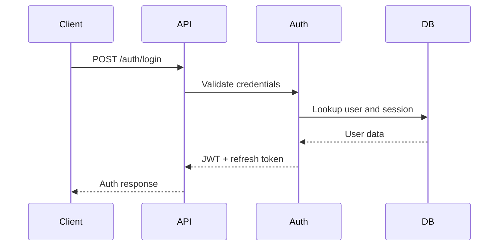

# API Design

## Overview
The API is a RESTful NestJS service exposing versioned endpoints for authentication, profiles, companies, hiring, reviews, search, notifications, and admin operations.

Note: LinkedOut reverses traditional hiring — companies discover professionals and send opportunities; professionals do not submit applications (see [decisions.md](decisions.md), D-001). The endpoint list below reflects that model.

## Versioning
- Base path: /api/v1
- Use explicit versioning in route definitions and contract files
- Deprecate gradually with compatibility windows

## Core Endpoints

### Authentication
- POST /api/v1/auth/register
- POST /api/v1/auth/login
- POST /api/v1/auth/refresh
- GET /api/v1/auth/me

### Professionals
- GET /api/v1/professionals/:id
- PATCH /api/v1/professionals/me
- GET /api/v1/professionals/me
- GET /api/v1/professionals/:id/reviews

### Companies
- GET /api/v1/companies
- POST /api/v1/companies
- GET /api/v1/companies/:id
- PATCH /api/v1/companies/:id
- GET /api/v1/companies/:id/reviews
- GET /api/v1/companies/:id/jobs

### Jobs and Opportunities
- GET /api/v1/companies/:id/jobs
- POST /api/v1/companies/:id/jobs
- POST /api/v1/jobs/:id/opportunities — company sends an opportunity to a professional
- GET /api/v1/opportunities — opportunities for the current professional
- POST /api/v1/opportunities/:id/respond — professional accepts or declines
- GET /api/v1/opportunities/:id/pipeline — hiring pipeline stage history (append-only)

### Reviews
- POST /api/v1/reviews — requires a verified EmploymentHistory
- GET /api/v1/reviews/:id
- PATCH /api/v1/reviews/:id — subject to edit cooldown; companies cannot edit or delete
- POST /api/v1/reviews/:id/reply — one company reply per review
- POST /api/v1/reviews/:id/vote

### Notifications
- GET /api/v1/notifications
- PATCH /api/v1/notifications/:id/read

### Admin / Moderation
- GET /api/v1/admin/moderation
- PATCH /api/v1/admin/moderation/:id
- GET /api/v1/admin/analytics

## OpenAPI Strategy
- Generate OpenAPI from decorators and shared DTOs
- Publish Swagger UI in non-production environments
- Use contract tests to protect public API compatibility

## Sequence Example

