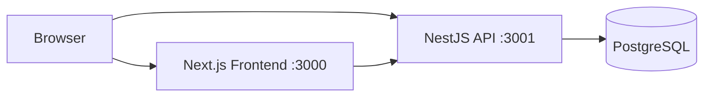

# Architecture

## Overview

LinkedOut is a monorepo with a Next.js web app, a NestJS API, and a shared Drizzle/PostgreSQL database package. There is no reverse proxy, event bus, cache layer, or observability stack in front of it today — this is a straightforward request/response API talking directly to Postgres, running entirely in local Docker Compose. Anything more elaborate below is a documented future direction, not current state.

## Monorepo Structure

- `apps/web` — Next.js 15 / React 19 frontend
- `apps/api` — NestJS backend API
- `packages/database` — Drizzle ORM schema, migrations, and the shared `db` client (`@linkedout/database`)
- `packages/ui`, `packages/config`, `packages/types` — empty placeholder packages, not yet used by anything
- `docs` — architecture, roadmap, decisions, ADRs

## Architectural Principles (as actually practiced)

- Domain-organized NestJS modules (`auth`, `professionals`, `companies`, `hiring`, `publishing`, `reviews`, `moderation`) with their own controller/service/repository layers
- Drizzle's parameterized query builder throughout — no raw SQL, so there's no SQL-injection surface
- `ValidationPipe({whitelist: true, transform: true})` globally — unexpected or server-controlled fields in a request body are silently dropped, not trusted
- Contact info shared with a company only after a professional accepts an opportunity ([decisions.md](decisions.md) D-002/D-003)

## Runtime View (current, not aspirational)

Provisioned in `docker-compose.yml` but **not referenced by any application code**: Valkey (Redis), MinIO, Meilisearch. They start as containers and sit idle. Don't build against them without first checking whether they're actually wired up — they aren't, as of this writing.

## Module Boundaries (as implemented)

- **Auth** — registration, login, JWT issuance/rotation/revocation-on-suspend, email verification, role/status
- **Professionals** — profiles, employment history + company-verification, expectations, skills, portfolio links
- **Companies** — company profiles, locations, benefits, admin claim, verification, jobs
- **Hiring** — opportunities (company → professional), accept/decline + contact methods, append-only hiring pipeline
- **Publishing** — posts, comments, likes, attachments
- **Reviews** — verified-employment-gated reviews, ratings, company replies
- **Moderation** — moderation cases/actions, trust flags, audit logs, admin role management

## Not implemented (see [docs/features.md](features.md) for the full deferred list)

Event-driven integration, notifications, AI/ML integrations, a search index, a cache layer, object storage for uploads, and any reverse proxy or observability stack. These were part of an earlier, more speculative architecture sketch for this project; the current direction deliberately keeps the system to what's needed for the reverse-hiring product (see [vision.md](vision.md)).
