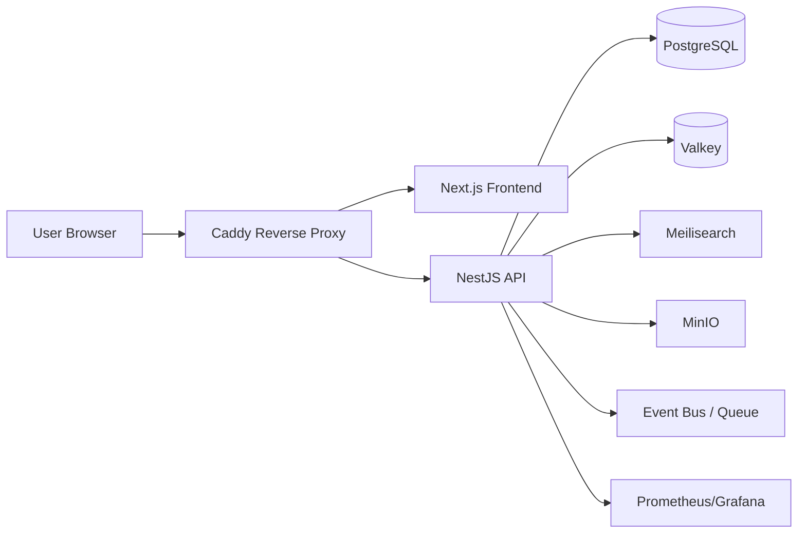

# Architecture

## Overview
LinkedOut is a modular monorepo composed of a Next.js web application, a NestJS API service, shared packages, and supporting infrastructure services. The system is designed for incremental delivery, clear module boundaries, and future cloud compatibility.

## Monorepo Structure
- apps/web: React/Next.js frontend
- apps/api: NestJS backend API
- packages/ui: shared design system and UI primitives
- packages/config: linting, formatting, and shared tool configuration
- packages/types: shared domain and API contracts
- docs: architecture, roadmap, policy, ADRs

## Architectural Principles
- Domain-driven modules with explicit boundaries
- API-first contracts between frontend and backend
- Event-driven integration for asynchronous processes
- Observability and security by default
- Infrastructure as code and containerized deployment

## Runtime View

## Module Boundaries
- Auth: authentication, session, RBAC, identity
- Users: profiles, preferences, verification
- Companies: employer profiles, company metadata, employer verification
- Reviews: reviews, ratings, evidence, moderation
- Applications: company application flows, candidate evaluation
- Search: indexing, search, ranking
- Notifications: emails, in-app, webhooks
- Media: file upload, avatar, identity documents
- Integrations: AI, analytics, webhooks, third-party connectors
