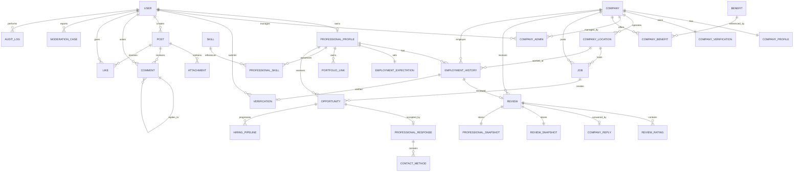

# LinkedOut ER Diagram

> Status: Draft
> Version: MVP v1

```mermaid
erDiagram

USER ||--o| PROFESSIONAL_PROFILE : owns
USER ||--o{ COMPANY_ADMIN : manages
USER ||--o{ VERIFICATION : submits
USER ||--o{ POST : creates
USER ||--o{ COMMENT : writes
USER ||--o{ LIKE : gives
USER ||--o{ MODERATION_CASE : reports
USER ||--o{ AUDIT_LOG : performs

PROFESSIONAL_PROFILE ||--o{ EMPLOYMENT_HISTORY : has
PROFESSIONAL_PROFILE ||--|| EMPLOYMENT_EXPECTATION : sets
PROFESSIONAL_PROFILE ||--o{ PORTFOLIO_LINK : owns
PROFESSIONAL_PROFILE ||--o{ PROFESSIONAL_SKILL : possesses
PROFESSIONAL_PROFILE ||--o{ OPPORTUNITY : receives

SKILL ||--o{ PROFESSIONAL_SKILL : references

COMPANY ||--|| COMPANY_PROFILE : has
COMPANY ||--|| COMPANY_VERIFICATION : owns
COMPANY ||--o{ COMPANY_LOCATION : operates
COMPANY ||--o{ COMPANY_ADMIN : managed_by
COMPANY ||--o{ COMPANY_BENEFIT : offers
COMPANY ||--o{ JOB : posts
COMPANY ||--o{ REVIEW : receives
COMPANY ||--o{ EMPLOYMENT_HISTORY : employer

BENEFIT ||--o{ COMPANY_BENEFIT : referenced_by

COMPANY_LOCATION ||--o{ JOB : hosts
COMPANY_LOCATION ||--o{ EMPLOYMENT_HISTORY : worked_at

JOB ||--o{ OPPORTUNITY : creates

OPPORTUNITY ||--o| PROFESSIONAL_RESPONSE : accepted_by
OPPORTUNITY ||--o{ HIRING_PIPELINE : progresses

PROFESSIONAL_RESPONSE ||--o{ CONTACT_METHOD : contains

POST ||--o{ ATTACHMENT : contains
POST ||--o{ COMMENT : receives
POST ||--o{ LIKE : receives

COMMENT ||--o{ COMMENT : replies_to

EMPLOYMENT_HISTORY ||--o| REVIEW : reviewed
EMPLOYMENT_HISTORY ||--o| VERIFICATION : verified

REVIEW ||--o{ REVIEW_RATING : contains
REVIEW ||--o| COMPANY_REPLY : answered_by
REVIEW ||--|| REVIEW_SNAPSHOT : stores
REVIEW ||--|| PROFESSIONAL_SNAPSHOT : stores
```
