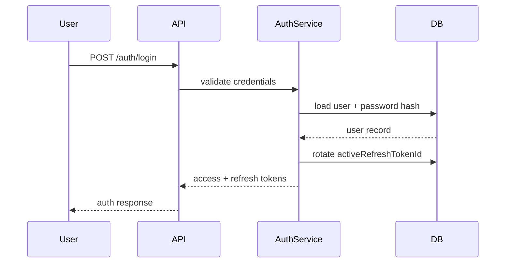

# Authentication Architecture

This describes the actual implementation, not a target design — it matches `apps/api/src/auth`.

## Flow

1. `POST /auth/register` — creates a `users` row + a `professionalProfiles` row in one transaction, hashes the password with bcrypt, issues tokens (the account is usable immediately, like most consumer apps), and sends a verification email via `MailerService`. When `RESEND_API_KEY` is set, this is a real email through Resend; otherwise (local dev/test default) the link is logged to the console instead, and also returned directly in the response as `devVerificationToken`.
2. `POST /auth/login` — validates credentials, checks account status, issues tokens.
3. `POST /auth/refresh` — validates the refresh token, checks account status, checks the token hasn't already been used, issues a new token pair.
4. `POST /auth/logout` — clears the account's active refresh token, invalidating it immediately.
5. `POST /auth/verify-email` — single-use; rejects if the account is already verified or the token's email no longer matches the account's current email. On success it returns a fresh access + refresh token pair (like login/register), not just a status flag — clicking a valid link is treated as proof of mailbox ownership, so it logs the user in even on a device/browser that never registered or logged in (the email client that opened the link, for instance).
6. Every protected endpoint runs through `AuthGuard`, which verifies the JWT, checks it's `type: 'access'` (not a refresh or verification token), and checks the account's live status in the database.
7. `POST /auth/forgot-password` — looks up the account by email and, if found and active, emails a password-reset link via `MailerService.sendPasswordResetEmail`. Always responds `{ sent: true }` regardless of whether the email is registered (plus `devResetToken` outside production), so the endpoint can't be used to enumerate which emails have accounts.
8. `POST /auth/reset-password` — verifies the reset token, hashes and stores the new password, and returns a fresh access + refresh token pair (same reasoning as `verify-email`: a valid reset link is itself proof of mailbox ownership). Also invalidates every other existing session, since resetting a password is often a response to a suspected account compromise.
9. `PATCH /auth/password` — authenticated password change; requires the correct current password, then re-issues tokens the same way.

## Tokens

- **Access tokens**: JWT, 15 minute expiry, `type: 'access'`. Verified on every request.
- **Refresh tokens**: JWT, 7 day expiry, `type: 'refresh'`, carry a `jti`. **Single-use and rotating** — `users.activeRefreshTokenId` stores the one currently-valid `jti` per user; each successful login/refresh replaces it, and a used or superseded refresh token is rejected. Effectively one active session per user at a time — logging in elsewhere invalidates the previous refresh token.
- **Email verification tokens**: JWT, 24 hour expiry, `type: 'email-verification'`. Single-use in practice — rejected once the account is already verified.
- **Password reset tokens**: JWT, 1 hour expiry, `type: 'password-reset'`, carry a `jti`. Single-use and rotating, mirroring refresh tokens exactly — `users.passwordResetTokenId` stores the one currently-valid `jti`, requesting a new reset link supersedes any earlier one, and the token is cleared (whether or not a reset was in flight) on any successful password change.
- All tokens are HS256-signed with `JWT_SECRET`. The API refuses to start if it's unset (no insecure code-level default). `docker-compose.yml` sets a literal `dev-secret` for local dev only — never reuse that value anywhere else.

## Password policy

`RegisterDto`, `ResetPasswordDto`, and `ChangePasswordDto` all require at least 8 characters **and** at least one non-whitespace character (`@Matches(/\S/)`) — `MinLength` alone is satisfied by a string of spaces, which a QA pass found let accounts be created (and logged into) with an all-space password.

## Guards

- `AuthGuard` — the base authentication check described above. Not constructor-injected (see the comment in `auth.guard.ts`): it's applied via `@UseGuards(AuthGuard)` across ~30 controllers in as many NestJS modules, and Nest resolves a guard's constructor dependencies against whichever module compiled it — a real dependency would need every one of those modules (and every isolated controller test) to provide it. It constructs its own `UserRepository` internally instead. It also loads `emailVerified` onto `request.user` alongside `status`, for `VerifiedEmailGuard` below.
- `ModeratorGuard` / `AdminGuard` — role checks on top of `AuthGuard`, reading `request.user.role` from the already-verified JWT claim (not re-checked against the database on every request — role changes take effect on the user's next token issuance).
- `VerifiedEmailGuard` — rejects with 403 unless `request.user.emailVerified` is true. Unverified users can otherwise use the app normally (browse, message, build their profile); this guard is applied only to the handful of actions that commit content or a decision visible to other users — creating a post/comment, publishing a review or a company's reply to one, posting a job, creating a job opportunity, and a candidate responding to an opportunity or an offer. It must run after `AuthGuard`/`OptionalAuthGuard` on the same route (`@UseGuards(AuthGuard, VerifiedEmailGuard)`), since it only reads `request.user` rather than authenticating on its own.

## What's not implemented

- No third-party auth provider (no OAuth/SSO) — this was scoped out, not a gap.
- No CSRF protection (the frontend uses bearer tokens in `localStorage`, not cookies, so CSRF isn't the primary risk here — but see [security.md](security.md) for the XSS-adjacent tradeoff that implies).
- No rate limiting on login/register — a known, tracked gap, not yet demonstrated as exploited.

## Sequence

