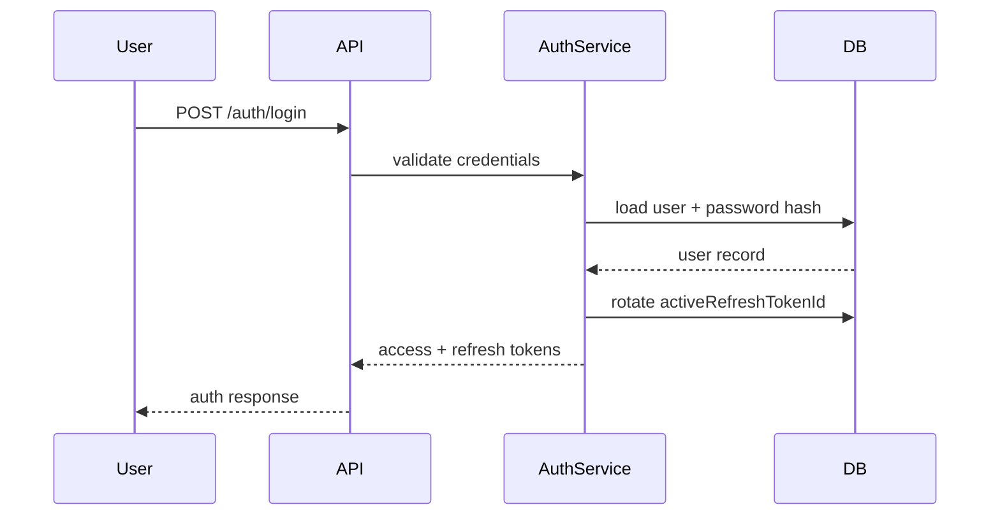

# Authentication Architecture

This describes the actual implementation, not a target design — it matches `apps/api/src/auth`.

## Flow

1. `POST /auth/register` — creates a `users` row + a `professionalProfiles` row in one transaction, hashes the password with bcrypt, issues tokens, and sends a verification token (dev-mode: returned directly in the response as `devVerificationToken`; there's no real email provider wired up yet).
2. `POST /auth/login` — validates credentials, checks account status, issues tokens.
3. `POST /auth/refresh` — validates the refresh token, checks account status, checks the token hasn't already been used, issues a new token pair.
4. `POST /auth/logout` — clears the account's active refresh token, invalidating it immediately.
5. `POST /auth/verify-email` — single-use; rejects if the account is already verified or the token's email no longer matches the account's current email.
6. Every protected endpoint runs through `AuthGuard`, which verifies the JWT, checks it's `type: 'access'` (not a refresh or verification token), and checks the account's live status in the database.

## Tokens

- **Access tokens**: JWT, 15 minute expiry, `type: 'access'`. Verified on every request.
- **Refresh tokens**: JWT, 7 day expiry, `type: 'refresh'`, carry a `jti`. **Single-use and rotating** — `users.activeRefreshTokenId` stores the one currently-valid `jti` per user; each successful login/refresh replaces it, and a used or superseded refresh token is rejected. Effectively one active session per user at a time — logging in elsewhere invalidates the previous refresh token.
- **Email verification tokens**: JWT, 24 hour expiry, `type: 'email-verification'`. Single-use in practice — rejected once the account is already verified.
- All tokens are HS256-signed with `JWT_SECRET`. The API refuses to start if it's unset (no insecure code-level default). `docker-compose.yml` sets a literal `dev-secret` for local dev only — never reuse that value anywhere else.

## Guards

- `AuthGuard` — the base authentication check described above. Not constructor-injected (see the comment in `auth.guard.ts`): it's applied via `@UseGuards(AuthGuard)` across ~30 controllers in as many NestJS modules, and Nest resolves a guard's constructor dependencies against whichever module compiled it — a real dependency would need every one of those modules (and every isolated controller test) to provide it. It constructs its own `UserRepository` internally instead.
- `ModeratorGuard` / `AdminGuard` — role checks on top of `AuthGuard`, reading `request.user.role` from the already-verified JWT claim (not re-checked against the database on every request — role changes take effect on the user's next token issuance).

## What's not implemented

- No third-party auth provider (no OAuth/SSO) — this was scoped out, not a gap.
- No CSRF protection (the frontend uses bearer tokens in `localStorage`, not cookies, so CSRF isn't the primary risk here — but see [security.md](security.md) for the XSS-adjacent tradeoff that implies).
- No rate limiting on login/register — a known, tracked gap, not yet demonstrated as exploited.

## Sequence

