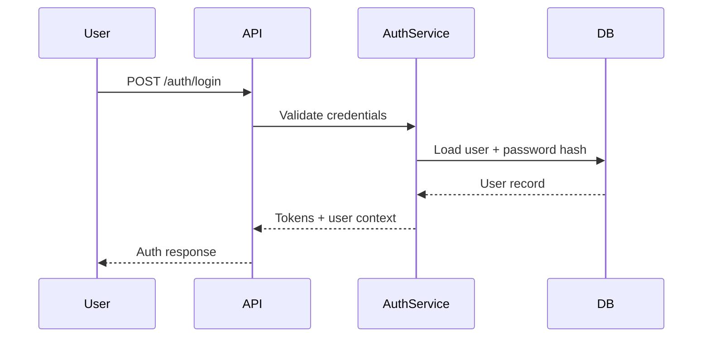

# Authentication Architecture

## Goals
- Secure, low-friction sign-in for employees and employers
- Support both traditional credentials and social identity providers in later phases
- Separate identity concerns from profile data and authorization decisions

## Flow
1. User submits credentials to the auth endpoint.
2. API validates credentials and issues an access token and refresh token.
3. Refresh tokens are stored as hashed values and rotated on use.
4. Access tokens are validated by middleware on each protected request.
5. User context is resolved from JWT claims and database-backed roles.

## Recommended Components
- Better Auth for session and provider abstraction
- JWT access tokens with short lifetimes
- Refresh token rotation and revocation support
- Role and permission enforcement inside NestJS guards and interceptors

## Sequence Diagram

