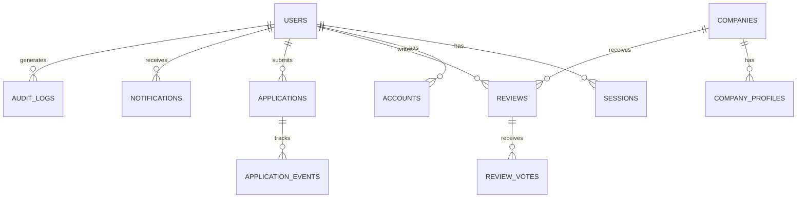

# Database Design

## Overview
PostgreSQL is the system of record. Drizzle ORM is used for schema management, migrations, and query building. The database is structured around core identity, company and talent entities, reviews, ratings, moderation, and platform operations.

## Core Tables
- users
- sessions
- accounts
- companies
- company_profiles
- employees
- reviews
- review_votes
- applications
- application_events
- notifications
- audit_logs
- feature_flags
- moderation_cases
- verification_requests
- search_index_jobs

## Conceptual ER Diagram

## Data Principles
- Use UUID primary keys for cross-service compatibility
- Maintain immutable audit trails for moderation and security decisions
- Separate mutable profile state from immutable identity state
- Use soft delete for user-facing content moderation
- Keep denormalized counters for search and ranking in sync via background jobs
