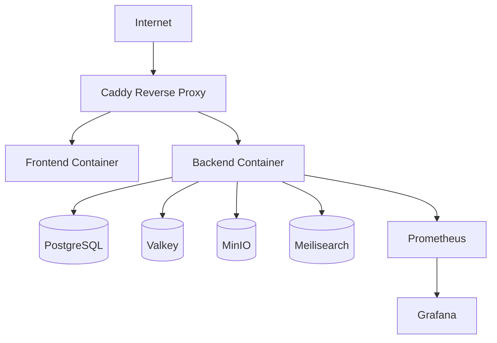

# Deployment Design

> **Status: Deferred, not implemented.** LinkedOut has never been deployed outside local Docker Compose (Postgres + API). There is no Caddy, Prometheus, Grafana, Kubernetes, or CI/CD deploy step today — CI runs lint/test/typecheck only. This is a target design for when the product is ready to launch, kept for reference — see [PROJECT_STATUS.md](../PROJECT_STATUS.md).

## Target Environment

- Self-hosted Ubuntu server
- Docker Compose for initial deployments
- Future compatibility with Kubernetes and cloud-managed services

## Runtime Services

- Web frontend container
- API container
- PostgreSQL container
- Valkey container
- MinIO container
- Meilisearch container
- Caddy reverse proxy
- Prometheus and Grafana containers

## Deployment Topology

## Release Strategy

- Blue/green or rolling deployments for the API
- Tagged releases for rollback safety
- Environment separation between development, staging, and production
- Avoid direct database writes from application containers during deploys
